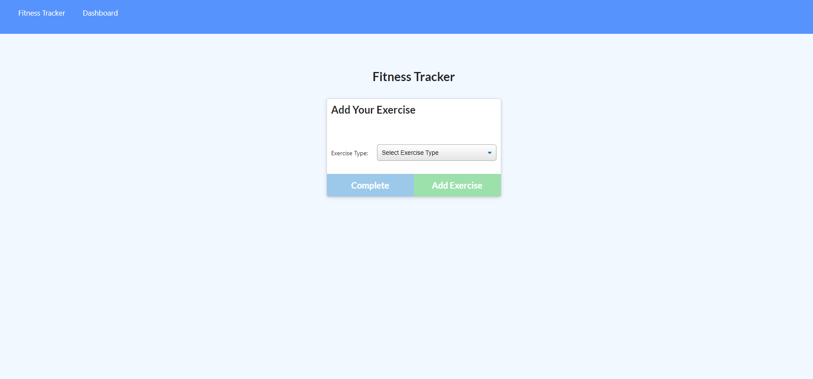
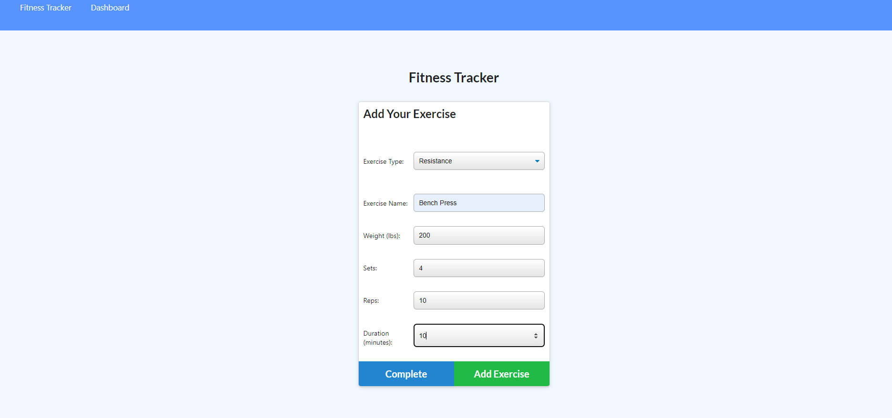

# NoSQL workout tracker

  ## Table of Contents

  * [About](#about)
  * [Build](#build)
  * [User-Ability](#User)
  * [Installation](#installation)
  * [Milestones](#milestones)
  * [Demo](#demo)
  * [Contributing](#contributing)

## About

Mongo database with a Mongoose schema and handle routes with Express for a workout tracker.

## Build

It can be time consuming navigating through complicted fitness tracking apps and you just want a straight forward logging experience that lets you see your progress immediatly. I want to create and track daily workouts in a snap, log multiple exercises in a workout on a given day and I should also be able to track the name, type, weight, sets, reps, and duration of esercise. If the esercise is a cardio exercise, should be able to track my distance traveled.

Creating a server code and models to compliment the public files that were provided. The user would also need a means to get, pull etc the data I created the routes for the reqs accordingly.

A consumer will reach their fitness goals when they can track their workout progress quickly.

## User Ability

When a user loads the page, they shou be given the option to create a new workout or continue with their last workout.

the user should be able to: 
    - Add exercises to the most recent workout plan 
    - Add new exercises to a new workout plan
    - View the combined weight fo multiple exercises from the past seven workouts on the 'stats' page
    - View the total duration of each workout from the past seven workouts on the 'stats' page

## Installation
 - MongoDB 
 - MongoDB Atlas
 - Mongoose
 - Heroku
 - Nodejs

Branch and clone fitness tracker to your machine.
Install node dependencies in terminal
Start server

## Project milestones
Digging through starter code to assess what additional code is needed to get the workouts and stats working
Adding exports, mongoose, express and routers to api and server
Testing charts, ran into and error in the CLI
Troubleshot and found usercreate index and usefindandmodify on my mongoose server connection threw parse errors. I removed them and the server started running properly.
Need to fix my get at put requests, they are appearing as undefined, working with a TA for the 304 on GET and POST. Updating heroku app and relaunching.

## Demo and Links

  ![heroku]https://fitness-app-thing.herokuapp.com/

  

  

  ## Contributing 

  Pull requests are welcome. For major changes, please open an issue first to discuss what you would like to change.

  Please make sure to update tests as appropriate. 